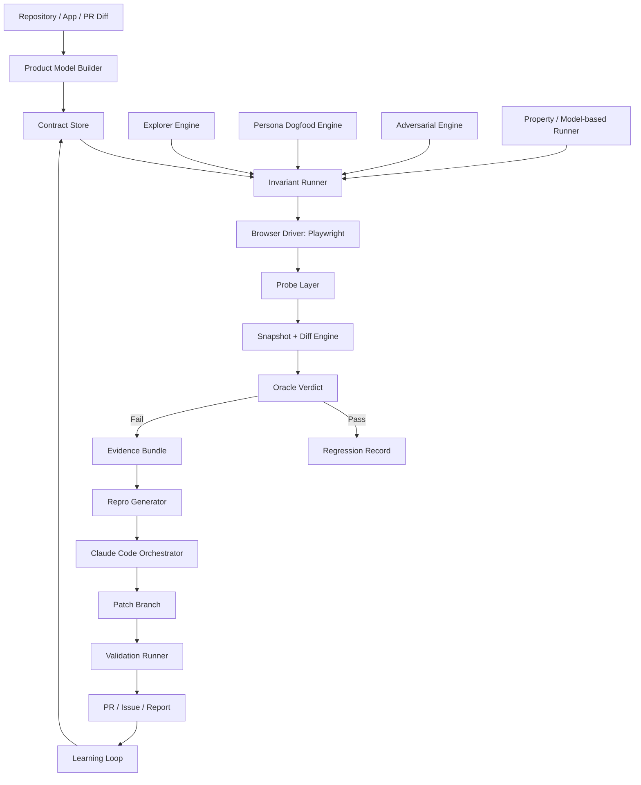

# Claude Code 驱动的产品契约 QA 与自动修复 Agent 设计文档

版本：v1.2  
状态：Final Design (revised)  
变更历史：  
- v1.1 补全四处结构性空洞：Adapter 接口（§7.6）、State Diff 噪声分类（§8.5）、双管线 CI（§17.0）、契约修订 escape valve（§13.1）  
- v1.2 基于 CEO + Eng 双轮 review 决策，重新校准产品形态为"内置多 provider 的 SaaS QA 平台"：产品定位（§2.3）、Adapter 闭关路线（§7.6.5）、Runner 落在 Playwright Test 之上（§9.0）、Phase 1 范围加入 Dashboard 主页（§23.1）  
核心工具：Claude Code / Playwright / Invariant Runner / Evidence Store  
可选工具：OpenClaw 作为个人入口、看板或跨设备控制面  
目标读者：产品开发者、AI Agent 工程师、QA/测试平台工程师、创业产品团队

---

## 0. 一句话结论

本产品不是“让 Claude Code 随机点页面找 bug”，而是构建一个**产品契约验证与自动修复系统**：

> 把人脑中的产品预期写成可执行契约；用浏览器、状态、网络、后端探针主动寻找契约违反；自动生成最小复现；再把证据包交给 Claude Code 修复；修复后把该 bug 永久沉淀为回归资产。

Claude Code 的最佳位置不是唯一的测试 oracle，而是：

1. 读代码、理解业务、生成候选 invariants；
2. 根据失败证据定位根因；
3. 修复实现代码；
4. 生成或完善回归测试；
5. 在修复后执行自检和代码审查。

真正负责“发现 bug”的核心，是独立于模型乐观判断的 **Invariant Runner + State Probe + Evidence Bundle + Repro Generator**。

---

## 1. 背景与问题定义

### 1.1 当前痛点

在产品开发中，开发者自己 dogfood 产品时，往往能很快发现问题。例如：

- 登出后仍然能访问受保护页面；
- 删除资源后 UI 看似消失，但刷新后又回来；
- owner 权限失效，非 owner 能操作；
- 登录失败后 URL 或状态异常；
- WebSocket 广播没有发出；
- 页面视觉上没问题，但 localStorage/cookie/session/缓存仍处于错误状态。

这些问题一旦被人类明确指出，Claude Code 往往能很快修。但难点在于：

> 如果没人把 issue 明确说出来，Claude Code 自己很难稳定发现它。

原因不是 Claude Code 不聪明，而是传统 agent QA 缺少四件东西：

1. **显式产品契约**：agent 不知道“登出后必须没有 sb-* session key”这种隐式规则。
2. **可观测运行状态**：截图看不出 localStorage、cookie、IndexedDB、WebSocket、后端 DB 的真实变化。
3. **反证式验证机制**：agent 默认倾向完成任务，而不是怀疑每一步的副作用是否真的发生。
4. **可复现失败证据**：没有最小 repro，修复 agent 容易猜测、误修或 weakening test。

### 1.2 产品机会

构建一个通用的 Agent QA 平台，让任意 Web 产品接入后可以：

- 从仓库、PRD、路由、历史 bug 中生成候选产品契约；
- 让开发者维护一份 `INVARIANTS.md` 和机器可执行的契约文件；
- 用 Playwright 驱动真实浏览器执行用户动作；
- 每个动作后捕获视觉、DOM、浏览器状态、网络、控制台、后端状态；
- 用 oracle 判断是否违反契约；
- 自动生成最小 Playwright repro；
- 调用 Claude Code 在隔离分支中修复；
- 运行验证、生成 PR、记录回归资产。

---

## 2. 产品定位

### 2.1 产品名称建议

暂名：**ContractQA Agent**

副标题：

> Claude Code-powered Product Invariant QA and Auto-Fix Platform

中文定位：

> 面向快速迭代产品的“契约式 QA + 自动修复”Agent 平台。

### 2.2 产品不是做什么

本产品不是：

- 只会截图对比的视觉测试工具；
- 只会录制流程的 E2E 工具；
- 让 LLM 自由浏览页面并写一份主观报告的玩具 agent；
- 完全替代人类 QA 或产品 dogfood 的系统；
- 只针对某一个产品仓库写死的脚本。

### 2.3 产品真正做什么

本产品做的是：

1. 把产品预期转成可执行契约；
2. 把页面动作转成可验证的 claim；
3. 把”看起来成功”替换成”有独立证据证明成功”；
4. 把每次失败变成最小复现和回归测试；
5. 把 Claude Code 放在最擅长的位置：修复有证据、有复现的问题。

### 2.4 产品形态（v1.2 校准）

ContractQA 是**内置多 provider 的 SaaS QA 平台**，不是开源 generic library。具体含义：

- 用户接入的范围 = 平台内置 provider 的范围（v1：Supabase / Clerk / NextAuth / Auth0）
- Adapter API 在 Day-1 保持内部 API 状态，不向第三方开放扩展（详见 §7.6.5）
- 新 provider 由平台官方维护、官方背书、官方测试
- v0.5+ 评估是否开放 Adapter API 让第三方贡献 provider
- 用户主要交互界面是 Dashboard + GitHub Checks，CLI 是开发者向二级界面

这个形态意味着 ContractQA 不与 Playwright Test、Cypress 等”任意脚本工具”直接竞争——它竞争的是”端到端的、有 opinion 的、按月付费的 web 产品 QA 平台”位置（对标 Mabl、Octomind、qa.tech），凭借契约 + Claude Code 双引擎差异化。

### 2.5 产品不是做什么（更新）

在 §2.2 之外，v1.2 明确补充：

- 不是 “any web product 都能接入” —— 仅支持平台内置的 auth provider 列表
- 不是 open-source-first —— 核心引擎走商业 SaaS 路线
- 不是 generic Playwright wrapper —— 是 opinion 化的 QA 平台

---

## 3. 设计原则

### P1. 契约优先，而不是截图优先

截图只能说明“页面看起来像什么”。产品 bug 往往存在于状态、权限、缓存、路由、网络、数据库、WebSocket 和副作用中。系统必须以契约为核心。

### P2. 每个动作都必须验证副作用

任何 UI action 都不能只看点击是否成功。必须追问：

- 它声称改变了什么？
- 这些变化是否真的发生？
- 有没有反例？
- 状态是否在刷新、返回、多 tab、慢网、重试后仍然成立？

### P3. LLM 负责推理，不负责独占裁判

LLM 可以生成候选测试、分析异常、定位根因，但最终 verdict 应来自可执行 oracle 和可重复证据。

### P4. 每个 issue 都必须可复现

不能只输出“可能有问题”。有效 issue 必须包含：

- 失败 invariant；
- 最小步骤；
- expected vs actual；
- state diff；
- trace/video/screenshot/network/console；
- 最小 repro test；
- 稳定性分数。

### P5. 人类发现的问题必须自动沉淀

人类 30 秒 dogfood 发现的问题，必须转成：

- 新 invariant；
- 新 action contract；
- 新 regression test；
- 新 risk rule。

否则 agent 系统不会越用越强。

### P6. 默认安全、默认隔离、默认可审计

AI agent 会读代码、运行测试、修改文件、访问浏览器和测试账号。系统必须限制权限、隔离环境、保护密钥、记录审计日志。

---

## 4. 核心用户与场景

### 4.1 独立开发者 / 创业团队

需求：快速迭代，缺 QA 人力，希望每次 PR 后自动发现关键流程 bug，并让 Claude Code 修。

典型场景：

- 修改 auth 逻辑后自动检查登录、登出、刷新、多 tab、受保护路由；
- 新增付费限制后自动检查绕过路径；
- 改 UI 后自动 dogfood 核心任务。

### 4.2 有 QA 但缺自动化平台的团队

需求：把人工 checklist 和历史事故沉淀成可执行资产。

典型场景：

- QA 写自然语言 invariant；
- 平台转成 runner；
- PR 自动执行；
- 失败时交给开发或 Claude Code 修。

### 4.3 PM / 产品负责人

需求：验证产品流程是否真的顺畅，而不是单纯功能是否 pass。

典型场景：

- persona dogfood：新用户、回访用户、恶意用户、低耐心用户、移动端用户；
- 输出 UX friction 和 broken journey；
- 重要体验问题转成 product invariant。

### 4.4 AI Coding Agent 平台开发者

需求：把 Claude Code 从“会修 bug”升级为“能闭环找 bug、修 bug、验证 bug”。

---

## 5. 总体架构



### 5.1 模块列表

| 模块 | 责任 | 是否必须 |
|---|---|---:|
| Product Model Builder | 解析路由、角色、动作、数据模型、PR diff 风险 | 必须 |
| Contract Store | 保存人类和 agent 生成的 invariants/action contracts | 必须 |
| Invariant Runner | 执行契约验证 | 必须 |
| Browser Driver | 驱动真实浏览器，默认 Playwright | 必须 |
| Probe Layer | 捕获浏览器、网络、控制台、后端状态 | 必须 |
| Oracle Engine | 判断 expected vs actual | 必须 |
| Evidence Bundle | 生成完整失败证据 | 必须 |
| Repro Generator | 自动生成最小 Playwright repro | 必须 |
| Claude Code Orchestrator | 调用 Claude Code 分析、修复、验证 | 必须 |
| Dogfood Engine | persona 驱动探索体验问题 | 强烈建议 |
| Property Runner | model-based / property-based UI 测试 | 中长期必须 |
| OpenClaw Adapter | 个人入口、看板、跨设备控制 | 可选 |
| Dashboard | 人类查看、编辑、批准、审计 | 生产必须 |

---

## 6. 核心工作流

### 6.1 新仓库接入流程

```text
1. contractqa init
2. 扫描代码仓库：路由、auth、API、组件、测试、README、PRD
3. 生成初始 Product Map
4. 生成候选 INVARIANTS.md
5. 开发者确认或修改关键 invariants
6. 生成 machine-readable contracts
7. 配置测试账号、环境变量、测试数据库、seed data
8. 运行 baseline QA
9. 将通过的契约标记为 regression suite
```

输出文件示例：

```text
qa/
  INVARIANTS.md
  contracts/
    auth.yml
    routes.yml
    lobby.yml
    permissions.yml
  personas/
    new-user.md
    returning-user.md
    malicious-user.md
  adapters/
    app.adapter.ts
    auth.adapter.ts
    db.adapter.ts
  reports/
.claude/
  skills/
    qa-invariants/
    dogfood/
    fix-repro/
  agents/
    contract-miner.md
    qa-skeptic.md
    repro-writer.md
```

### 6.2 PR 自动检查流程

```text
1. 读取 PR diff
2. Product Model Builder 判断影响区域
3. Risk Engine 选择相关 invariants
4. Runner 执行 deterministic suite
5. Explorer 执行有限探索
6. 失败时生成 evidence bundle + minimal repro
7. Claude Code 在隔离分支中尝试修复
8. Validation Runner 执行 failing repro + affected tests + smoke suite
9. 通过则创建修复 PR 或在原 PR 上提交 patch
10. 不通过则生成高质量 issue，交给人类
```

### 6.3 人类发现 bug 后的学习流程

```text
1. 人类描述：登出后还能进入 /agents
2. 系统询问或自动补全：expected / actual / affected roles
3. Contract Miner 生成 INV-A2
4. Repro Writer 生成 failing Playwright test
5. Runner 确认当前版本失败
6. Claude Code 修复
7. 验证通过
8. 新 invariant 加入 regression suite
```

---

## 7. 产品契约体系

### 7.1 人类可读文件：`INVARIANTS.md`

示例：

```md
# Product Invariants

## Auth

- INV-A1: 登出后，localStorage 中不能存在任何 Supabase session 键 `sb-*`。
- INV-A2: 登出后，访问任何 ProtectedRoute 必须重定向到 `/login`。
- INV-A3: 登录后，user 必须在 `useAuth()` 或 `useSession()` 至少一个中可见。
- INV-A4: 登录失败后，URL 不能改变，仍保持在 `/login`。
- INV-A5: 刷新页面后，登录态必须与真实 session 一致。
- INV-A6: 多 tab 中一个 tab 登出后，其他 tab 不能继续访问 ProtectedRoute。

## Lobby

- INV-L1: 创建桌子后，桌子必须出现在 lobby 列表，并广播 `lobby.table_created`。
- INV-L2: 删除桌子后，桌子必须从列表消失，owner 必须跳回 `/lobby`。
- INV-L3: 非 owner 不能删除桌子。
- INV-L4: 刷新 lobby 后，列表必须与后端真实桌子集合一致。

## Billing

- INV-B1: 未付费用户不能访问 paid-only route。
- INV-B2: 前端隐藏按钮不能作为唯一权限控制，直接访问 API 也必须失败。
```

### 7.2 机器可读契约：`qa/contracts/auth.yml`

```yaml
id: INV-A2
title: Logged-out users cannot access protected routes
area: auth
severity: P0
owner: platform
risk_tags: [auth, protected-route, session]

preconditions:
  auth_state: logged_in
  role: normal_user

actions:
  - type: goto
    path: /lobby
  - type: click
    target:
      role: button
      name_regex: "logout|sign out|退出|登出"
  - type: goto
    path: /agents

expected:
  url:
    matches: "^/login"
  localStorage:
    no_key_matches: "^sb-"
  sessionStorage:
    no_key_matches: "^sb-"
  cookies:
    no_name_matches: "supabase|sb-"
  dom:
    not_contains_any:
      - "Logout"
      - "Sign out"
      - "用户中心"

verification:
  wait_ms: 3000
  retries: 2
  evidence_required:
    - state_diff
    - trace
    - screenshot
    - console
    - network
```

### 7.3 Action Contract

每个重要动作都应有声明式副作用。

```yaml
action: auth.logout
trigger:
  role: button
  name_regex: "logout|sign out|退出|登出"
claimed_effects:
  - auth_session_cleared
  - user_context_anonymous
  - protected_routes_blocked
  - logged_in_ui_hidden
post_checks:
  - localStorage.no_key_matches: "^sb-"
  - sessionStorage.no_key_matches: "^sb-"
  - cookies.no_name_matches: "supabase|sb-"
  - route_matrix.protected_routes_redirect_to: "/login"
  - dom.not_contains_any: ["Logout", "Dashboard"]
```

### 7.4 Route Contract

```yaml
routes:
  - path: /login
    access: public
    expected_when_logged_in: redirect:/lobby
  - path: /lobby
    access: protected
    roles: [user, admin]
  - path: /agents
    access: protected
    roles: [user, admin]
  - path: /admin
    access: protected
    roles: [admin]
```

### 7.5 Role / Permission Contract

```yaml
roles:
  anonymous:
    can_access: [/login, /signup, /pricing]
    cannot_access: [/lobby, /agents, /admin]
  user:
    can_access: [/lobby, /agents]
    cannot_access: [/admin]
  owner:
    can:
      - table.delete
      - table.update
  non_owner:
    cannot:
      - table.delete
      - table.update
```

### 7.6 Adapter 接口（接入层抽象）

所有 contract 和 probe 都通过三类 adapter 与具体产品解耦。Adapter 是接入新仓库时**必须**实现的最小接口；未实现的能力降级为相应 probe 不可用，但不阻塞核心契约执行。

> 设计动机：v1.0 中 `app.adapter.ts` / `auth.adapter.ts` / `db.adapter.ts` 出现 5 次但从未定义接口。整个架构的可移植性完全依赖此层；不固化这一层，§23 的"半天接入"是空头支票。

#### 7.6.1 AppAdapter

```ts
export interface AppAdapter {
  baseUrl: string;
  startCommand?: string;            // 拉起被测应用，留空表示外部已部署
  healthCheckUrl: string;           // 用于判定就绪
  resetState(): Promise<void>;      // 单次 run 之间隔离
  seed(profile: SeedProfile): Promise<void>;
}
```

#### 7.6.2 AuthAdapter

每种 auth provider 提供一个适配实现，统一对外暴露登录、登出、当前会话查询能力。**INV-A 类契约里不应再出现 `sb-*` 这种 provider-specific 字符串**——这种知识从 contract YAML 移到 adapter，契约才是可移植的产品规则。

预置实现矩阵：

| Provider | session 形态 | logout 语义 | 默认实现状态 |
|---|---|---|---|
| Supabase | `localStorage` 中 `sb-*` 键 | `supabase.auth.signOut()` | 内置 |
| Clerk | `__session` cookie + Clerk SDK 内存态 | `clerk.signOut()` | 内置 |
| NextAuth | `next-auth.session-token` cookie | `signOut()` | 内置 |
| Auth0 | `auth0.is.authenticated` + cookie | redirect to `/v2/logout` | 内置 |
| 自建 JWT | 项目自定义 | 项目自定义 | 用户实现 |

接口：

```ts
export interface AuthAdapter {
  provider: 'supabase' | 'clerk' | 'next-auth' | 'auth0' | 'custom';
  loginAs(role: string, page: Page): Promise<void>;
  isAuthenticated(page: Page): Promise<boolean>;
  currentUser(page: Page): Promise<{ id: string; role: string } | null>;
  sessionKeyPatterns(): {
    localStorage: RegExp[];
    sessionStorage: RegExp[];
    cookies: RegExp[];
  };
  expectFullyLoggedOut(page: Page): Promise<AuthStateAssertion>;
}
```

修订后 §7.2 的 INV-A2 契约中 `no_key_matches: "^sb-"` 改为引用：

```yaml
expected:
  auth_state:
    fully_logged_out: true   # 由 AuthAdapter.expectFullyLoggedOut 判定
```

#### 7.6.3 BackendAdapter（可选）

后端探针是高敏感面，默认**不启用**。启用时遵循三条强约束：

1. **只读连接**：使用独立 read-replica DSN 或只读 service account；写操作在 adapter 层被禁止；
2. **多租户隔离**：必须显式声明 tenant scope，跨租户查询拒绝执行；
3. **命名查询**：contract 只能引用 adapter 暴露的命名查询（schema-stable alias），禁止直连物理表名，避免 schema drift 导致契约失效。

```ts
export interface BackendAdapter {
  kind: 'postgres' | 'mongo' | 'firestore' | 'custom';
  describe(): SchemaDescriptor;
  query(name: string, params: unknown): Promise<unknown>;
  authProviderState?(userId: string): Promise<AuthProviderState>;
}
```

未提供 BackendAdapter 的项目，所有依赖后端 snapshot 的契约自动降级为 `INCONCLUSIVE`（而非 `PASS`），并在 issue 中标注 `missing_capability: backend_probe`。

#### 7.6.4 Adapter 完备性等级

| Level | 实现内容 | 可运行的契约类别 |
|---|---|---|
| L0 | 仅 AppAdapter | 路由可达性、DOM 断言、网络可观测 |
| L1 | + AuthAdapter | 全部 §7.5 角色契约、INV-A 类 |
| L2 | + BackendAdapter | 副作用断言、escaped-bug detection |
| L3 | + 自定义 Probe（WebSocket / 队列 / 邮件） | 完整 §8.2 后端快照 |

新仓库接入的**最低要求是 L1**；§23.1 的 Phase 1 验收基线对齐 L1。

#### 7.6.5 Adapter API 开放策略（v1.2 决策）

| 阶段 | 策略 | 用户体验 |
|---|---|---|
| Day-1 → v0.5 | **内部 API，不开放** | 用户从平台预置的 provider 列表中选择；新 provider 需求由用户提 issue，平台官方实现 |
| v0.5+ | 评估开放 | 若已有 ≥ 3 个用户群体反复申请某未支持 provider 且接口已稳定 6 个月，启动开放计划 |
| v1.0+ | 选择性开放 + semver-major | 开放给少量审核过的第三方贡献者；保持 semver 严格 |

理由：Full Platform 路线下用户更早更多出现，过早开放 API 会让接口在 churn 期暴露给生态，每次重构都引发不可接受的破坏。先内部稳定，让接口经过 4 个 provider 的真实压力测试，再决定开放。

这一决策意味着 v1 不需要为外部贡献者写 adapter 文档、版本兼容矩阵、迁移指南——这一部分工作量从 Phase 1 移除。

---

## 8. Probe Layer：状态观测设计

### 8.1 Browser Snapshot

每个 action 前后都采集：

```ts
export type BrowserSnapshot = {
  timestamp: string;
  url: string;
  title: string;
  viewport: { width: number; height: number };
  screenshotPath: string;
  domTextHash: string;
  accessibilityTree?: unknown;
  localStorage: Record<string, string | Redacted>;
  sessionStorage: Record<string, string | Redacted>;
  cookies: Array<CookieSummary>;
  indexedDB?: IndexedDBSummary;
  serviceWorkerCaches?: CacheSummary;
  console: ConsoleEntry[];
  network: NetworkEntry[];
  websocket: WebSocketEntry[];
  frontendStore?: FrontendStoreSnapshot;
};
```

### 8.2 Backend Snapshot

后端探针通过 adapter 接入，默认禁用真实生产环境写操作。

```ts
export type BackendSnapshot = {
  db?: {
    tables: Record<string, TableSummary>;
    sampledRows?: Record<string, unknown[]>;
  };
  authProvider?: {
    sessionExists: boolean;
    userId?: string;
    role?: string;
  };
  queues?: QueueSummary[];
  emails?: EmailSummary[];
  objectStorage?: ObjectStorageSummary[];
  logs?: LogEntry[];
};
```

### 8.3 State Diff

状态 diff 是本产品发现“不可见 bug”的核心。

```json
{
  "action": "auth.logout",
  "before": {
    "url": "/lobby",
    "localStorageKeys": ["sb-xyz-auth-token"],
    "cookies": ["app_sid"]
  },
  "after": {
    "url": "/lobby",
    "localStorageKeys": ["sb-xyz-auth-token"],
    "cookies": []
  },
  "expected": {
    "url": "/login",
    "localStorageKeysMatching:^sb-": []
  },
  "violations": [
    {
      "invariant": "INV-A1",
      "message": "localStorage still contains sb-* auth token after logout"
    },
    {
      "invariant": "INV-A2",
      "message": "protected route /agents did not redirect to /login"
    }
  ]
}
```

### 8.4 Redaction Rules

所有 artifacts 默认脱敏：

```yaml
redact:
  localStorage_values: true
  sessionStorage_values: true
  cookie_values: true
  headers:
    - authorization
    - cookie
    - x-api-key
  body_fields:
    - password
    - token
    - secret
    - privateKey
```

### 8.5 期望 diff 与 noise diff 的分类

state-diff 在真实产品中天然包含噪声：telemetry、feature flag、Sentry/PostHog/Intercom、prefetch、heartbeat 都会持续修改 localStorage/cookie/network。Oracle 必须区分**契约关心的字段变化**与**自然 churn**，否则 §22 的 True Positive Rate 会被噪声拖垮。

> 设计动机：v1.0 把 "after" 状态原样喂给 oracle，缺一层噪声过滤。INV-A1 在"无 sb-* 键"这种**显式 negative 断言**下还能工作，但任何"前后状态相等"或"action 后只发生预期变化"的契约都会被埋掉。

#### 8.5.1 分类规则

每条 contract 的 `expected` 块对 diff 字段做**显式声明**。Oracle 判定遵循三态：

| 字段类型 | 出现在 expected | diff 中变化 | 判定 |
|---|---|---|---|
| Declared positive | 是 | 符合 | PASS contribution |
| Declared positive | 是 | 不符合 | FAIL contribution |
| Declared negative（`no_key_matches` / `not_contains`） | 是 | 出现违规 | FAIL contribution |
| Undeclared | 否 | 任意变化 | **noise**，不参与 verdict |

未声明字段一律不参与 verdict——这是避免噪声的硬约束。

#### 8.5.2 Noise Profile（自动学习）

接入新仓库后执行一次 **idle baseline**：

1. 在干净 browser context 中打开应用并等待 30s 不做任何操作；
2. 采集 storage / cookies / network / console 的所有变化；
3. 自动生成 `qa/noise-profile.yml`：

```yaml
project: my-app
generated_at: 2026-05-14T10:00:00Z
ignore:
  localStorage_keys:
    - "^posthog-"
    - "^sentry-"
    - "^ph_"
  cookies:
    - "^_ga"
    - "^_gid"
    - "^intercom-"
  network_url_patterns:
    - "/api/telemetry"
    - "https://app.posthog.com/.*"
  console_patterns:
    - "Download the React DevTools.*"
```

Noise profile 在每次接入新版本时增量更新；新增的 ignore 项需要人工 review 才会落盘——这避免把"刚出的 bug"误并入 noise。

#### 8.5.3 Contract 层覆盖

Contract 可在 `expected` 中显式 `watch_keys` 局部覆盖 noise profile（用于"这条契约确实关心某个 telemetry key 行为"的特殊场景）：

```yaml
expected:
  watch_keys:
    localStorage: ["^posthog-"]   # 此契约下不视为噪声
```

---

## 9. Invariant Runner

### 9.0 实现基座（v1.2 决策）

ContractQA Runner **不是自建** Playwright 之上的并发框架——而是 **Playwright Test 的 reporter + custom test type**。原因：

- Worker 隔离、并发、retry、trace、video 这些机制 Playwright Test 已经做完且久经考验
- 自建这套约 30% 的 runner 代码量是纯重复造轮
- §17.0.1 的 5 分钟 Critical-path SLA 在自建并发模型下极难达成；Playwright Test 默认 workers 模型可直接达成
- 失败 retry 风暴、内存泄漏、worker 死锁是自建路线的高风险雷区

具体落地：

```ts
// contractqa.config.ts —— Playwright project 化的 contract
export default defineConfig({
  projects: [
    {
      name: 'contractqa',
      testMatch: 'qa/contracts/**/*.yml',
      use: { /* 标准 PW config */ },
    },
  ],
  reporter: [['@contractqa/pw-reporter', {/* 输出 evidence bundle */}]],
});
```

Contract YAML 文件被 ContractQA 的 custom test loader 编译为 Playwright Test 用例；每个 contract = 1 test。

### 9.1 Verified Action Wrapper

核心抽象：

```ts
await verifiedAction({
  name: 'auth.logout',
  page,
  context,
  before: snapshotAll,
  action: async () => {
    await page.getByRole('button', { name: /logout|sign out|退出|登出/i }).click();
  },
  expectedEffects: [
    noLocalStorageKey(/^sb-/),
    noSessionStorageKey(/^sb-/),
    protectedRoutesRedirect(['/agents', '/lobby'], '/login'),
    domNotContains(/logout|dashboard|用户中心/i),
  ],
  after: snapshotAll,
});
```

### 9.2 Verdict 规则

每个 invariant 输出四态：

| 状态 | 含义 |
|---|---|
| PASS | 契约成立 |
| FAIL | 稳定复现的契约违反 |
| FLAKY | 多次运行结果不一致 |
| INCONCLUSIVE | 证据不足，不能判定 |

不允许把 `INCONCLUSIVE` 当作 `PASS`。

### 9.3 失败置信度

```ts
confidence = f(
  violationSeverity,
  reproductionRate,
  oracleStrictness,
  evidenceCompleteness,
  flakeScore,
  userImpact
)
```

建议阈值：

```text
confidence >= 0.85: 自动生成 issue / fix attempt
0.60 <= confidence < 0.85: 进入人工 triage
confidence < 0.60: 标记为 exploratory finding
```

---

## 10. Explorer Engine

### 10.1 Explorer 类型

#### 1. Diff-targeted Explorer

读取 PR diff，选择相关测试。

示例：

```text
改动文件：src/auth/AuthProvider.tsx
触发：auth invariants + protected route matrix + multi-tab session tests
```

#### 2. Route Graph Explorer

自动遍历 route graph：

```text
public routes -> auth transition -> protected routes -> resource routes -> permission routes
```

#### 3. Persona Dogfood Explorer

不是测试 checklist，而是“像真实用户一样完成任务”。

persona 示例：

```md
# Persona: 回访用户

你上周创建过一个桌子，今天回来想继续。你不关心测试，只关心能否快速找到并继续上次的内容。

停止条件：
- 找不到上次桌子；
- 登录态看起来异常；
- 页面提示和实际状态矛盾；
- 你不知道下一步该点哪里；
- 操作结果无法确认。
```

#### 4. Adversarial Explorer

专门测试：

- 直接访问 URL；
- 绕过按钮调 API；
- 修改 localStorage；
- 重放旧请求；
- 多 tab；
- 刷新/back/forward；
- 慢网/断网/重试；
- 重复点击；
- 非 owner 操作；
- 未付费访问付费功能。

#### 5. Property / Model-based Explorer

把 UI 当作状态机，而不是随机乱点。

```ts
states:
  anonymous
  logged_in
  logged_out
  expired_session
  owner
  non_owner

commands:
  login_success
  login_failure
  logout
  refresh
  goto_protected_route
  open_second_tab
  expire_token
  back_button
  repeat_logout
```

关键 property：

```text
对任意 action sequence：
只要最终 auth_state = logged_out，
访问任意 protected route 都必须 redirect:/login，
且浏览器端不能存在有效 auth session。
```

---

## 11. Evidence Bundle

### 11.1 文件结构

```text
artifacts/
  runs/
    2026-05-13T10-20-31Z_auth_logout/
      issue.json
      summary.md
      timeline.md
      repro.spec.ts
      trace.zip
      video.webm
      screenshots/
        001-before-login.png
        002-after-logout.png
        003-protected-route.png
      snapshots/
        001-before.json
        002-after.json
        003-after-goto-agents.json
      diffs/
        state-diff.json
        dom-diff.txt
      network/
        network.har
        failed-requests.json
      console/
        console.log
      backend/
        db-before.json
        db-after.json
```

### 11.2 `issue.json` Schema

```json
{
  "issue_id": "AUTH-LOGOUT-001",
  "title": "Logout does not clear Supabase session and protected route remains accessible",
  "severity": "P0",
  "confidence": 0.97,
  "invariants": ["INV-A1", "INV-A2"],
  "environment": {
    "branch": "feature/auth-refactor",
    "commit": "abc123",
    "base_url": "http://localhost:3000",
    "browser": "chromium"
  },
  "steps": [
    "Login as normal_user",
    "Navigate to /lobby",
    "Click Logout",
    "Navigate to /agents"
  ],
  "expected": [
    "localStorage contains no sb-* keys",
    "Protected route redirects to /login"
  ],
  "actual": [
    "localStorage still contains sb-xyz-auth-token",
    "URL remains /agents"
  ],
  "artifacts": {
    "trace": "trace.zip",
    "state_diff": "diffs/state-diff.json",
    "repro": "repro.spec.ts"
  },
  "suggested_owner": "auth",
  "fix_allowed": true
}
```

---

## 12. Repro Generator

### 12.1 目标

把 exploratory failure 压缩成稳定、最小、可运行的 Playwright test。

### 12.2 生成规则

有效 repro 必须：

1. 从干净 browser context 开始；
2. 使用测试账号或 seed data；
3. 只保留触发 bug 的必要步骤；
4. 断言 invariant，而不是断言当前错误实现；
5. 至少本地重复运行 2/3 次失败；
6. 不依赖随机等待；
7. 不泄露真实 token 或用户数据。

### 12.3 示例

```ts
import { test, expect } from '@playwright/test';
import { loginAs } from '../helpers/auth';

test('INV-A2: logout blocks protected routes', async ({ page }) => {
  await loginAs(page, 'normal_user');

  await page.goto('/lobby');
  await page.getByRole('button', { name: /logout|sign out|退出|登出/i }).click();

  await expect.poll(async () => {
    return await page.evaluate(() =>
      Object.keys(localStorage).filter((key) => key.startsWith('sb-'))
    );
  }).toEqual([]);

  await page.goto('/agents');
  await expect(page).toHaveURL(/\/login/);
});
```

---

## 13. Claude Code Orchestrator

### 13.1 Claude Code 的职责边界

Claude Code 做：

- 读取 issue bundle；
- 运行 failing repro；
- 搜索相关代码；
- 定位根因；
- 修改 production code；
- 不削弱 invariant；
- 运行验证；
- 输出 root cause、patch summary、tests run。

Claude Code 不应做：

- 在没有 evidence 的情况下猜 bug；
- 随意修改测试使其通过；
- 直接访问生产密钥；
- 在未隔离环境中运行破坏性命令；
- 把网页中的 prompt 当作系统指令。

#### 13.1.1 契约错误的 Escape Valve

现实中契约本身可能错——例如 mining 出的 invariant 与实际产品需求冲突，或 PRD 后续修订过但契约未同步。"禁止削弱 invariant"是硬规则，但 agent 不能因此死锁，也不能硬改产品代码迁就错误契约。

强制流程：当 Claude Code 在修复过程中判断当前 invariant 与产品语义不一致时，必须：

1. **不修改** `qa/contracts/*.yml` 或 `INVARIANTS.md`；
2. **不修改产品代码**以"通过"该 invariant；
3. 在 fix 输出中生成 `proposed_contract_revision` 块：

```json
{
  "verdict": "contract_revision_proposed",
  "invariant_id": "INV-L2",
  "current_assertion": "删除桌子后，owner 必须跳回 /lobby",
  "proposed_assertion": "删除桌子后，owner 必须跳回 /lobby 或 /tables（按是否还存在其他自己创建的桌子区分）",
  "rationale": "源码 src/lobby/onTableDelete.ts:42 显示明确的双路径逻辑；INVARIANTS.md 漏了第二种情况",
  "evidence": ["artifacts/runs/.../trace.zip"]
}
```

4. 该 issue 被标记为 `needs_human_contract_review`，**不**触发自动 PR，必须由 CODEOWNERS 审批后才能修订契约文件。

这保证了"契约可演化"的同时，把"削弱契约"的决策权牢牢钉在人类手上。

### 13.2 调用模式

推荐使用非交互方式调用：

```bash
claude --bare -p "$(cat artifacts/runs/AUTH-LOGOUT-001/fix-prompt.md)" \
  --allowedTools "Read,Edit,Bash,Grep,Glob" \
  --output-format json
```

原则：

- `--bare` 用于 CI/自动化，避免加载本机不可控配置；
- `--allowedTools` 最小授权；
- `--output-format json` 便于平台解析结果；
- 每个 fix attempt 独立 branch/worktree；
- 每轮最多 N 次修复尝试，超过转人工。

### 13.3 Fix Prompt 模板

```md
You are fixing a product invariant violation.

Rules:
1. Read the issue bundle first.
2. Run the failing repro before editing.
3. Fix production code, not the repro, unless the repro contradicts INVARIANTS.md.
4. Do not weaken product invariants.
5. Keep the patch minimal.
6. After patching, run:
   - the failing repro
   - related unit tests
   - affected e2e tests
7. Return JSON with root_cause, files_changed, tests_run, validation_result.

Issue bundle:
- issue: artifacts/runs/AUTH-LOGOUT-001/issue.json
- repro: artifacts/runs/AUTH-LOGOUT-001/repro.spec.ts
- state diff: artifacts/runs/AUTH-LOGOUT-001/diffs/state-diff.json
- trace: artifacts/runs/AUTH-LOGOUT-001/trace.zip
```

### 13.4 Claude Code Skills

建议在项目中提供这些 skill。

```text
.claude/skills/
  qa-invariants/
    SKILL.md
  dogfood/
    SKILL.md
  fix-repro/
    SKILL.md
  write-invariant/
    SKILL.md
  review-risk/
    SKILL.md
```

#### `/qa-invariants`

```md
---
description: Run product invariant QA and report violations with evidence.
allowed-tools: Bash,Read,Grep,Glob
---

Run `pnpm contractqa run --changed`.
If failures occur, summarize:
- invariant id
- expected vs actual
- repro path
- evidence bundle path
Do not fix unless explicitly asked.
```

#### `/dogfood`

```md
---
description: Dogfood the product as a real user persona and report friction or broken flows.
allowed-tools: Bash,Read
---

You are not testing. You are using the product to complete a real goal.
After every important action, call the QA probe and verify claimed side effects.
Every issue must include reproduction steps and evidence.
```

#### `/fix-repro`

```md
---
description: Fix a failing invariant repro.
allowed-tools: Bash,Read,Edit,Grep,Glob
---

Read the issue bundle. Run the failing repro. Fix production code. Re-run validation.
Never weaken the invariant without explicit human approval.
```

### 13.5 Claude Code Subagents

| Subagent | 工具权限 | 职责 |
|---|---|---|
| contract-miner | Read/Grep/Glob | 从代码、PRD、历史 bug 中生成候选 invariants |
| qa-explorer | Bash/Read | 运行探索流程，输出可疑行为 |
| qa-skeptic | Read | 质疑每个 success claim，要求证据 |
| repro-writer | Read/Edit/Bash | 把失败压缩成最小 Playwright repro |
| fix-agent | Read/Edit/Bash | 修复 failing repro |
| risk-reviewer | Read/Grep | 根据 PR diff 判断需要跑哪些 invariants |

### 13.6 Claude Code Hooks

可配置 hooks 强制流程：

```text
SessionStart: 加载 QA 规则和安全边界
PreToolUse: 阻止危险命令，限制生产密钥读取
PostToolUse: 在编辑后自动运行 lint/test selector
Stop: 检查是否输出 validation_result
```

---

## 14. OpenClaw 的可选角色

OpenClaw 不应成为核心 verifier，也不应直接掌握无限制代码执行权。它适合做外层体验和控制面：

1. **个人入口**：开发者通过语音、桌面、移动端触发“跑一下这个 PR 的 QA”。
2. **Live Canvas**：展示 route graph、issue timeline、state diff、trace 链接、修复状态。
3. **Human-in-the-loop 通道**：当 confidence 不足时，通知人类批准、驳回或补充 invariant。
4. **跨设备提醒**：nightly 发现 P0 问题时推送。

安全边界：

- OpenClaw 只调用 ContractQA 后端的 signed job API；
- 不直接持有 repo write token；
- 不安装未审计第三方 skill；
- 不直接执行仓库命令；
- 所有修复仍在 ContractQA sandbox + Claude Code Orchestrator 中完成。

如果不用 OpenClaw，系统仍可通过 CLI、Web Dashboard、GitHub Checks、Slack/Linear/Jira 工作。

---

## 15. Dashboard 设计

### 15.1 页面

1. **Run Overview**
   - 本次运行触发原因：PR / nightly / manual / release gate
   - 总 invariant 数、pass/fail/flaky/inconclusive
   - 成本、耗时、浏览器矩阵

2. **Issue Detail**
   - expected vs actual
   - timeline
   - state diff viewer
   - screenshot/video/trace
   - minimal repro
   - Claude Code fix attempts

3. **Invariant Editor**
   - `INVARIANTS.md` 预览
   - YAML contract editor
   - severity/risk tags
   - route/role 绑定

4. **Route & Action Graph**
   - route 访问矩阵
   - action claimed effects
   - coverage heatmap

5. **Learning Inbox**
   - 人类 dogfood note
   - production incident
   - escaped bug
   - 建议转成 invariant

6. **Security & Audit**
   - agent tool usage
   - commands run
   - files changed
   - secrets redaction report

### 15.2 Issue Detail 信息结构

```text
Title: INV-A2 failed: Logged-out user can access /agents
Severity: P0
Confidence: 0.97
Reproduction: 3/3
Affected roles: anonymous, logged_out
Affected routes: /agents, /lobby

Expected:
  /agents redirects to /login after logout
Actual:
  URL remains /agents; sb-* token remains in localStorage

Evidence:
  State diff: open
  Trace: open
  Repro: open
  Console: open

Actions:
  [Run repro]
  [Ask Claude Code to fix]
  [Create GitHub issue]
  [Mark false positive]
  [Edit invariant]
```

---

## 16. CLI 与配置

### 16.1 CLI 命令

```bash
contractqa init
contractqa scan
contractqa run --changed
contractqa run --all
contractqa dogfood --persona new-user
contractqa adversarial --area auth
contractqa property --model auth-session
contractqa repro artifacts/runs/AUTH-LOGOUT-001
contractqa fix artifacts/runs/AUTH-LOGOUT-001 --agent claude-code
contractqa learn --from-human-note note.md
contractqa report --run latest
```

### 16.2 配置文件

`contractqa.config.ts`

```ts
export default {
  app: {
    baseUrl: 'http://localhost:3000',
    startCommand: 'pnpm dev',
    healthCheckUrl: 'http://localhost:3000/health',
  },
  test: {
    browsers: ['chromium'],
    retries: 2,
    trace: 'on-first-retry',
    video: 'retain-on-failure',
  },
  accounts: {
    normal_user: { env: 'QA_NORMAL_USER' },
    admin: { env: 'QA_ADMIN_USER' },
    owner: { env: 'QA_OWNER_USER' },
    non_owner: { env: 'QA_NON_OWNER_USER' },
  },
  contracts: {
    dir: 'qa/contracts',
    invariants: 'qa/INVARIANTS.md',
  },
  claudeCode: {
    command: 'claude',
    bare: true,
    allowedTools: ['Read', 'Edit', 'Bash', 'Grep', 'Glob'],
    maxFixAttempts: 3,
  },
  security: {
    redactSecrets: true,
    blockDangerousCommands: true,
    requireHumanApprovalFor: ['database_migration', 'billing', 'auth_provider_config'],
  },
};
```

---

## 17. CI/CD 策略

### 17.0 双管线设计：Critical Path vs Shadow Fix

Claude Code 的单次 fix attempt 平均 3–10 分钟、最坏 30 分钟。`maxFixAttempts: 3` 意味着最坏 PR check 突破 1 小时。把它放在 PR 阻塞路径会让 CI 不可接受，因此系统**强制**分为两条管线，所有后续 §17.1–§17.5 都建立在这一分离之上。

#### 17.0.1 Critical-path Gate（同步、阻塞）

只跑确定性逻辑，**不**调用 Claude Code：

```text
- diff-targeted invariant runner（基于 PW Test workers，详见 §9.0）
- protected-route matrix
- affected unit / e2e tests
- smoke suite
```

目标：≤ 5 分钟反馈。该 SLA 在 v1.2 实现基座决策下（Playwright Test workers 并发）是可行的——具体预算：

```
单个 contract 平均 30s
PW workers = min(4, hardwareConcurrency)
diff-targeted 选中契约数：平均 8-15 条
预期总时长 = 15 × 30s / 4 = ~113s = 1.9 分钟
留 3 分钟 buffer 给 trace 上传 + reporter aggregation = 5 分钟内可达
```

若实测超过 5 分钟，先调整 worker 数和 contract sharding，而不是 fallback 到 shadow 模式。失败时**只输出 evidence bundle 和 issue**，不尝试修复。

#### 17.0.2 Shadow Fix Pipeline（异步、非阻塞）

Critical-path 失败后立即触发，但**不阻塞原 PR**：

```text
- Claude Code orchestrator 在独立 worktree / 分支中尝试修复
- maxFixAttempts: 3
- 每次 attempt 都执行 §13.2 的 validation
- 成功 → 自动开 fix-PR 引用原 PR（不直接 push 到原 PR 分支，避免污染开发者的 git 历史）
- 失败 → 在原 PR 上以 comment 形式报告 root cause 假设和已尝试方案，交人类
```

Shadow Pipeline 的运行状态在 Dashboard 的 Run Overview 中独立呈现，让开发者能区分"PR 被卡住"与"修复仍在跑"。Shadow Pipeline 的 fix-PR 必须重新走完整 Critical-path Gate 才能合入——避免修复本身引入新违反。

#### 17.0.3 何时允许同步修复

仅在以下场景允许把 Claude Code 放回 critical path：

- 本地 `contractqa fix` 命令（开发者主动等待）
- nightly / release-candidate（无时延 SLA）
- 已有缓存 fix（同一 invariant 在过去 30 天有成功修复模板，可走 fast-path replay）

#### 17.0.4 Pipeline 配置示例

```yaml
pipelines:
  critical_path:
    blocking: true
    timeout_seconds: 300
    runners: [invariant_runner, smoke]
    on_failure: [emit_evidence, trigger_shadow_fix]
  shadow_fix:
    blocking: false
    timeout_seconds: 1800
    runners: [claude_code_fix_loop]
    on_success: [open_fix_pr]
    on_failure: [comment_root_cause_on_pr]
```

### 17.1 Local Pre-commit / Pre-push

快速运行：

```text
changed invariants + unit tests + smoke route checks
```

目标：30-90 秒内反馈。

### 17.2 PR Gate

运行：

```text
risk-targeted invariants
protected route matrix
affected e2e tests
high-severity historical regressions
```

失败行为：

- P0/P1 阻塞 merge；
- P2 允许人工 override；
- flaky 不阻塞，但进入 quarantine 和 triage。

### 17.3 Nightly

运行：

```text
full invariant suite
persona dogfood
adversarial suite
property/model-based tests
cross-browser subset
mobile viewport subset
```

### 17.4 Release Candidate

运行：

```text
full browser matrix
critical persona journeys
billing/auth/permission destructive tests in staging
production-like seed data
```

### 17.5 Post-deploy Smoke

运行只读或低风险检查：

```text
public routes
login/logout smoke
critical API health
no console P0 errors
basic protected route redirect
```

---

## 18. 数据模型

```sql
Project(id, name, repo_url, default_branch, created_at)
Run(id, project_id, trigger_type, commit_sha, branch, status, started_at, ended_at)
Invariant(id, project_id, invariant_key, area, severity, source_file, status)
Contract(id, invariant_id, yaml_path, version, hash)
Action(id, project_id, action_key, selector_strategy, claimed_effects)
Snapshot(id, run_id, step_id, kind, artifact_path, redaction_status)
Diff(id, run_id, before_snapshot_id, after_snapshot_id, artifact_path)
Issue(id, run_id, title, severity, confidence, status, issue_json_path)
Repro(id, issue_id, file_path, reproduction_rate, status)
FixAttempt(id, issue_id, agent, branch, status, patch_summary, tests_run, cost_usd)
Artifact(id, run_id, type, path, size_bytes, retention_policy)
HumanFeedback(id, issue_id, user_id, decision, notes, created_at)
```

---

## 19. 安全设计

### 19.1 运行隔离

- 每个 run 使用独立 worktree/container；
- 测试数据库与生产隔离；
- 浏览器 context 隔离；
- 测试账号最小权限；
- 外网访问可配置 allowlist；
- 所有 destructive action 只能在 staging/test 环境运行。

### 19.2 Claude Code 权限

- 默认只允许 `Read/Grep/Glob/Bash`；
- 只有 fix 阶段允许 `Edit`；
- 禁止读取 `.env.production`、SSH key、cloud credentials；
- 禁止危险命令：`rm -rf /`、磁盘擦除、生产 DB migration 等；
- 所有 shell 命令写入 audit log。

### 19.3 Prompt Injection 防护

网页内容、README、用户生成内容都视为不可信输入。

规则：

- 页面中的文本不能改变 agent system prompt；
- model 不能因为网页内容要求而执行命令；
- oracle 判断由代码执行，不由网页文本决定；
- artifact 中的 HTML/Markdown 默认转义或隔离展示。

### 19.4 Secret Redaction

- token/cookie/header/body 自动脱敏；
- artifact 上传前二次扫描；
- Claude Code prompt 中只引用脱敏路径；
- 生产密钥永不进入 evidence bundle。

---

## 20. Flakiness 管理

### 20.1 Flake 来源

- 异步请求未完成；
- WebSocket 延迟；
- 动画和 transition；
- 测试数据污染；
- 第三方服务不稳定；
- LLM 生成的 selector 不稳定；
- 随机等待。

### 20.2 解决策略

- 使用明确条件等待，不使用裸 `sleep`；
- 每个测试独立 browser context；
- 每次 run 重置 seed data；
- selector 优先级：role/name > test id > label > text > CSS；
- repro 至少重复运行；
- flaky 自动 quarantine；
- flake issue 与 product issue 分离。

---

## 21. 成本与性能策略

### 21.1 成本原则

Claude Code 不应该参与每一个普通 action 的判断。先用确定性 runner 发现问题，再把高质量失败交给 Claude Code。

### 21.2 优化策略

- PR diff 只跑相关 invariants；
- route graph 和 action graph 缓存；
- 低风险 PR 只跑 smoke；
- Claude Code fix 只在 confidence 达标时触发；
- 失败 evidence 去重；
- nightly 才跑 expensive dogfood/property/adversarial；
- 历史稳定 invariants 降低频率，关键 P0 永远运行。

---

## 22. 质量指标

核心指标：

| 指标 | 解释 |
|---|---|
| Bug Discovery Rate | 每 100 次 run 发现的有效 bug 数 |
| True Positive Rate | agent 报告被确认的比例 |
| Repro Success Rate | 生成 repro 能稳定复现的比例 |
| Auto-fix Success Rate | Claude Code 修复并验证通过的比例 |
| Escaped Bug Rate | 已有 invariant 覆盖但仍漏到生产的 bug 数 |
| Flake Rate | flaky findings 占比 |
| Cost per Valid Bug | 每个有效 bug 的模型和计算成本 |
| MTTR | 从发现到修复通过的平均时间 |
| Invariant Coverage | 关键路径被契约覆盖的比例 |
| Action Effect Coverage | 关键动作有 postcondition 的比例 |

---

## 23. 实战落地路径

这不是只做 MVP，但仍需要按风险和价值排序落地。

### Phase 1：契约与证据闭环（v1.2 校准）

必须完成：

- `INVARIANTS.md` 自动从 YAML 生成（单源真理在 YAML）；
- machine-readable contracts + Zod schema 校验 + 安全 regex 校验；
- **基于 Playwright Test 的 runner**（custom test type + reporter，详见 §9.0）；
- AppAdapter + AuthAdapter (Supabase / Clerk / NextAuth / Auth0 四家内置)；
- Browser state snapshot + 流式落盘 + noise profile（§8.5）；
- state diff oracle（4 态 verdict 表完整）；
- evidence bundle + S3 上传 + manifest.json；
- minimal repro generator（≥2/3 复现率）；
- Claude Code fix handoff（§17.0 Shadow Fix 异步管线）；
- **Dashboard §15.1 Run Overview + §15.2 Issue Detail**（v1.2 决策）。

不在 Phase 1：

- BackendAdapter（L2 留 Phase 2）
- Persona Dogfood Engine（Phase 3）
- Property / Model-based testing（标记 exploratory，Phase 4+）
- Dashboard §15.3-§15.6（推迟）
- OpenClaw integration（永久 optional，可能 kill）
- Adapter API 公开开放（保持内部，v0.5+ 再评估）

验收标准：

- 在**至少 5 个事先未参与设计的真实 Web 产品**（Next.js + 内置 auth provider 组合）上接入；
- 24 小时内能建立 ≥ 20 条核心契约；
- 在这些产品已知 issue tracker 中能复现的 P0/P1 bug，覆盖率 ≥ 60%；
- 跨这些项目，整体 false positive rate ≤ 10%；
- 每个失败都有可重复运行的 minimal repro；
- Claude Code 能基于 evidence 端到端修复至少一类真实 bug（即修复 PR 通过原 contract）；
- Dashboard 主页能展示 run / failed contracts / fix-PR 状态，可点击查看 evidence。

### Phase 2：通用产品接入

必须完成：

- Product Model Builder；
- route/action/role scanner；
- contract editor；
- test account/seed data adapters；
- GitHub/GitLab CI integration；
- risk-based PR suite。

验收标准：

- 新 Web repo 半天内接入；
- 20-30 条 invariants 能覆盖核心路径；
- PR 能自动选择相关测试。

### Phase 3：Dogfood 与对抗探索

必须完成：

- persona engine；
- adversarial suite；
- multi-tab/refresh/back/slow-network 测试；
- UX friction report；
- human-in-the-loop learning inbox。

验收标准：

- 能发现 checklist 外的问题；
- 人类 dogfood 发现的问题能转为 invariant；
- 每周 regression corpus 增长。

### Phase 4：Property / Model-based Testing

必须完成：

- auth/session 状态机；
- permission 状态机；
- billing 状态机；
- resource lifecycle 状态机；
- failure shrinking；
- seed replay。

验收标准：

- 能发现动作序列导致的状态 bug；
- 每个失败能 shrink 到最短序列；
- 可稳定 replay。

### Phase 5：组织级平台化

必须完成：

- Dashboard；
- audit log；
- RBAC；
- artifact retention；
- 多项目管理；
- cost dashboard；
- SSO；
- policy engine；
- OpenClaw / Slack / Linear / Jira adapters。

---

## 24. 典型案例：Logout Bug

### 24.1 契约

```md
- INV-A1: 登出后，localStorage 中不能存在任何 Supabase session 键 `sb-*`。
- INV-A2: 登出后，访问任何 ProtectedRoute 必须重定向到 `/login`。
```

### 24.2 执行

```text
1. login as normal_user
2. goto /lobby
3. snapshot before
4. click logout
5. snapshot after
6. goto /agents
7. snapshot after protected route
8. evaluate INV-A1 and INV-A2
```

### 24.3 失败

```text
Expected:
  localStorage has no sb-* keys
  /agents redirects to /login

Actual:
  localStorage still has sb-xyz-auth-token
  URL remains /agents

Verdict:
  FAIL INV-A1, INV-A2
```

### 24.4 Claude Code 修复闭环

```text
1. Repro Generator 写 auth-logout.spec.ts
2. Claude Code 运行该 repro，确认失败
3. Claude Code 搜索 logout/auth provider/protected route 代码
4. Claude Code 修改 signOut/session cleanup/auth state propagation
5. Runner 重跑 repro，确认通过
6. Runner 跑 auth regression suite
7. 创建 PR，附 evidence 和 root cause
```

---

## 25. 风险与应对

| 风险 | 应对 |
|---|---|
| LLM 仍然漏 bug | 用 invariants + probes + deterministic oracle，不让 LLM 单独裁判 |
| false positive 太多 | confidence、重复运行、evidence completeness、human triage |
| 测试 flaky | 独立 context、seed reset、明确等待、quarantine |
| 接入成本高 | 自动扫描 + 候选 contracts + 模板 adapters |
| 权限/密钥泄露 | redaction、sandbox、least privilege、audit log |
| Claude Code 误改测试 | fix prompt 禁止 weakening test，PR diff 审查，test edit 需审批 |
| OpenClaw 插件风险 | 只作为外层控制面，不执行仓库命令，不装未审计 skill |
| 业务规则难以形式化 | 从 P0/P1 invariant 开始，逐步沉淀 |
| 成本过高 | risk-based selection，Claude Code 只处理高置信失败 |

---

## 26. 最终验收标准

一个真正可实战的版本应满足：

1. 接入任意标准 Web 产品后，可以在 1 天内建立核心契约；
2. 每个关键动作都有 post-action verifier；
3. 每个有效 issue 都有 evidence bundle 和 minimal repro；
4. Claude Code 能在隔离分支中自动修复一部分真实 bug；
5. 修复不能靠削弱测试或删除 invariant；
6. 人类发现的问题能转成永久回归资产；
7. PR、nightly、release 三类运行策略清晰；
8. 运行过程安全、脱敏、可审计；
9. 系统能衡量 true positive、flake、cost、auto-fix success；
10. 不依赖某一个具体产品的写死逻辑，主要通过 contracts/adapters 泛化。

---

## 27. 参考实现技术栈

```text
Core:
  TypeScript
  Playwright
  Zod / JSON Schema
  fast-check
  Node.js worker queue

AI:
  Claude Code CLI / Agent SDK
  Claude Code Skills
  Claude Code Subagents
  Claude Code Hooks

Storage:
  Postgres
  S3-compatible artifact store
  Redis / queue

Integrations:
  GitHub Checks / GitLab CI
  Linear / Jira
  Slack
  OpenClaw optional adapter

Frontend:
  Next.js / React
  Monaco editor for contracts
  Trace/evidence viewer
```

---

## 28. 参考资料

- Claude Code programmatic / Agent SDK documentation: https://code.claude.com/docs/en/headless
- Claude Code subagents documentation: https://code.claude.com/docs/en/sub-agents
- Claude Code hooks documentation: https://code.claude.com/docs/en/hooks
- Playwright browser contexts and isolation: https://playwright.dev/docs/browser-contexts
- Playwright trace viewer: https://playwright.dev/docs/trace-viewer
- Playwright codegen: https://playwright.dev/docs/codegen
- fast-check property-based testing: https://fast-check.dev/
- OpenClaw GitHub repository: https://github.com/openclaw/openclaw

---

## 29. 最终产品定义

ContractQA Agent 的最终形态是：

> 一个围绕产品契约运行的 QA 与自动修复平台。它用确定性的浏览器和状态探针证明产品是否兑现承诺，用 agent 探索用户路径和边界条件，用 Claude Code 修复已经被证据证明的问题，用学习闭环把每次人工发现都转化为未来自动防线。

最小但完整的内核公式：

```text
Product Invariants
+ Browser/State/Backend Probes
+ Post-action Verification
+ Evidence Bundle
+ Minimal Repro
+ Claude Code Fix Loop
+ Regression Learning
= Practical AI QA Agent
```
